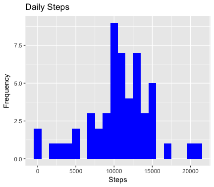
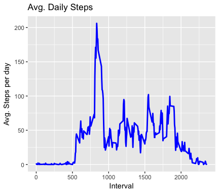
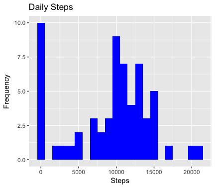
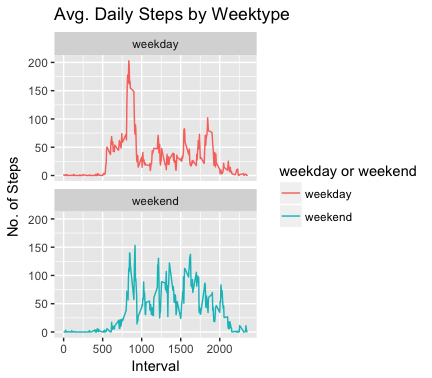

```{r setup, include=FALSE}
knitr::opts_chunk$set(echo = TRUE)
```


1 Loading and preprocessing the data
===============
##### Unzip data to obtain a csv file

```r
library("data.table")
library(ggplot2)

fileUrl <- "https://d396qusza40orc.cloudfront.net/repdata%2Fdata%2Factivity.zip"
download.file(fileUrl, destfile = paste0(getwd(), '/repdata%2Fdata%2Factivity.zip'), method = "curl")
unzip("repdata%2Fdata%2Factivity.zip",exdir = "data")
```

##### Reading csv Data into Data.Table

```r
activityDT <- data.table::fread(input = "data/activity.csv")
```

<br>

2 What is mean total number of steps taken per day?
===========
##### Calculating the total number of steps taken per day

```r
Total_Steps <- activityDT[, c(lapply(.SD, sum, na.rm = FALSE)), .SDcols = c("steps"), by = .(date)] 

head(Total_Steps, 10)
```

```
head(Total_Steps, 10)
          date steps
 1: 2012-10-01    NA
 2: 2012-10-02   126
 3: 2012-10-03 11352
 4: 2012-10-04 12116
 5: 2012-10-05 13294
 6: 2012-10-06 15420
 7: 2012-10-07 11015
 8: 2012-10-08    NA
 9: 2012-10-09 12811
10: 2012-10-10  9900
```

##### Making a histogram of the total number of steps taken each day (I removed 8 rows containing non-finite values (stat_bin))
```r
ggplot(Total_Steps, aes(x = steps)) +
        geom_histogram(fill = "blue", binwidth = 1000) +
        labs(title = "Daily Steps", x = "Steps", y = "Frequency")
```



##### Calculating and report the mean and median of the total number of steps taken per day
```r
Total_Steps[, .(Mean_Steps = mean(steps, na.rm = TRUE), Median_Steps = median(steps, na.rm = TRUE))]
```
```
 Mean_Steps Median_Steps
1:   10766.19        10765
```
<br>

3 What is the average daily activity pattern?
=================
##### Making a time series plot (i.e. 𝚝𝚢𝚙𝚎 = "𝚕") of the 5-minute interval (x-axis) and the average number of steps taken, averaged across all days (y-axis)

```r
IntervalDT <- activityDT[, c(lapply(.SD, mean, na.rm = TRUE)), .SDcols = c("steps"), by = .(interval)] 
```
```r
ggplot(IntervalDT, aes(x = interval , y = steps)) + geom_line(color="blue", size=1) + labs(title = "Avg. Daily Steps", x = "Interval", y = "Avg. Steps per day")
```



##### Which 5-minute interval, on average across all the days in the dataset, contains the maximum number of steps?
```r
IntervalDT[steps == max(steps), .(max_interval = interval)]
```

```
 max_interval
1:          835
```
<br>

4 Imputing missing values
===========
##### Calculating the total number of missing values in the dataset (i.e. the total number of rows with NAs)
```r
activityDT[is.na(steps), .N ]
```
```
activityDT[is.na(steps), .N ]
[1] 2304
```

##### Strategy for filling in all of the missing values in the dataset: Filling in missing values with median of dataset.
```r
activityDT[is.na(steps), "steps"] <- activityDT[, c(lapply(.SD, median, na.rm = TRUE)), .SDcols = c("steps")]
```
##### Creating a new dataset that is equal to the original dataset but with the missing data filled in.
```r
data.table::fwrite(x = activityDT, file = "data/tidyData.csv", quote = FALSE)
```
<br>

##### Histogram of the total number of steps taken each day after missing values are imputed:

<br>

##### 1 total number of steps taken per day
```r
Total_Steps <- activityDT[, c(lapply(.SD, sum)), .SDcols = c("steps"), by = .(date)] 
```
##### 2 mean and median total number of steps taken per day
```r
Total_Steps[, .(Mean_Steps = mean(steps), Median_Steps = median(steps))]

```
 Mean_Steps Median_Steps
1:    9354.23        10395
```

ggplot(Total_Steps, aes(x = steps)) + geom_histogram(fill = "blue", binwidth = 1000) + labs(title = "Daily Steps", x = "Steps", y = "Frequency")
```



<br>

5 Are there differences in activity patterns between weekdays and weekends?
============
##### Panel plot comparing the average number of steps taken per 5-minute interval across weekdays and weekends

<br>

##### 1 Create a new factor variable in the dataset with two levels – “weekday” and “weekend” indicating whether a given date is a weekday or weekend day.
```r
activityDT <- data.table::fread(input = "data/activity.csv")
activityDT[, date := as.POSIXct(date, format = "%Y-%m-%d")]
activityDT[, `Day of Week`:= weekdays(x = date)]
activityDT[grepl(pattern = "Montag|Dienstag|Mittwoch|Donnerstag|Freitag", x = `Day of Week`), "weekday or weekend"]<- "weekday"
activityDT[grepl(pattern = "Samstag|Sonntag", x = `Day of Week`), "weekday or weekend"] <- "weekend"
activityDT[, `weekday or weekend` := as.factor(`weekday or weekend`)]
head(activityDT, 20)
```
```
head(activityDT, 20)
    steps       date interval Day of Week weekday or weekend
 1:    NA 2012-10-01        0      Montag            weekday
 2:    NA 2012-10-01        5      Montag            weekday
 3:    NA 2012-10-01       10      Montag            weekday
 4:    NA 2012-10-01       15      Montag            weekday
 5:    NA 2012-10-01       20      Montag            weekday
 6:    NA 2012-10-01       25      Montag            weekday
 7:    NA 2012-10-01       30      Montag            weekday
 8:    NA 2012-10-01       35      Montag            weekday
 9:    NA 2012-10-01       40      Montag            weekday
10:    NA 2012-10-01       45      Montag            weekday
11:    NA 2012-10-01       50      Montag            weekday
12:    NA 2012-10-01       55      Montag            weekday
13:    NA 2012-10-01      100      Montag            weekday
14:    NA 2012-10-01      105      Montag            weekday
15:    NA 2012-10-01      110      Montag            weekday
16:    NA 2012-10-01      115      Montag            weekday
17:    NA 2012-10-01      120      Montag            weekday
18:    NA 2012-10-01      125      Montag            weekday
19:    NA 2012-10-01      130      Montag            weekday
20:    NA 2012-10-01      135      Montag            weekday
```
<br>

##### 2 Make a panel plot containing a time series plot (i.e. 𝚝𝚢𝚙𝚎 = "𝚕") of the 5-minute interval (x-axis) and the average number of steps taken, averaged across all weekday days or weekend days (y-axis)


```r
activityDT[is.na(steps), "steps"] <- activityDT[, c(lapply(.SD, median, na.rm = TRUE)), .SDcols = c("steps")]
IntervalDT <- activityDT[, c(lapply(.SD, mean, na.rm = TRUE)), .SDcols = c("steps"), by = .(interval, `weekday or weekend`)] 
```

```r
ggplot(IntervalDT , aes(x = interval , y = steps, color=`weekday or weekend`)) + geom_line() + labs(title = "Avg. Daily Steps by Weektype", x = "Interval", y = "No. of Steps") + facet_wrap(~`weekday or weekend` , ncol = 1, nrow=2)

```



